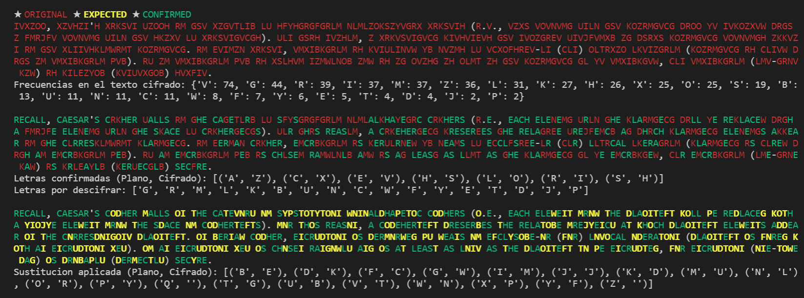

## Mi primera vez con el análisis de frecuencias

### Introducción

Hace un par de semanas tuve mi primera clase práctica de [Criptología](https://es.wikipedia.org/wiki/Criptolog%C3%ADa). El profesor nos mandó descifrar el siguiente texto:

_Ivxzoo, Xzvhzi'h xrksvi uzooh rm gsv xzgvtlib lu hfyhgrgfgrlm nlmlzokszyvgrx xrksvih (r.v., vzxs vovnvmg uiln gsv kozrmgvcg droo yv ivkozxvw drgs z fmrjfv vovnvmg uiln gsv hkzxv lu xrksvigvcgh). Uli gsrh ivzhlm, z xrkvsvigvcg kivhvievh gsv ivozgrev uivjfvmxb zg dsrxs kozrmgvcg vovnvmgh zkkvzi rm gsv xliivhklmwrmt kozrmgvcg. Rm Evimzn xrksvi, vmxibkgrlm rh kviulinvw yb nvzmh lu vCxofhrev-LI (CLI) oltrxzo lkvizgrlm (kozrmgvcg rh CLIvw drgs zm vmxibkgrlm pvb). Ru zm vmxibkgrlm pvb rh xslhvm izmwlnob zmw rh zg ovzhg zh olmt zh gsv kozrmgvcg gl yv vmxibkgvw, CLI vmxibkgrlm (lmv-grnv kzw) rh kilezyob (kviuvxgob) hvxfiv._

El profesor no nos dijo qué tipo de cifrado se le aplicó al mensaje, pero nos dio dos pistas: El texto original estaba en **inglés**, y nos dio la primera palabra descifrada:

- R -> I
- E -> v
- C -> k
- A -> z
- L -> o
- L -> o

Las dos 'L' cifradas como 'O' permiten suponer que el texto está cifrado utilizando un algoritmo de sustitución monoalfabeto (por tanto cada letra del texto original se cifrará de la misma forma). Los mensajes cifrados mediante este tipo de algoritmos son susceptibles a ser descifrados mediante **[análisis de frecuencias](https://es.wikipedia.org/wiki/An%C3%A1lisis_de_frecuencias)**.

En ese momento en lugar de ponerme manualmente a descifrar el texto o a buscar alguna herramienta para hacerlo, me pregunté cómo lo haría usando mis conocimientos de programación.

### Desarrollo

#### Obtener las frecuencias de las letras del texto

Para empezar creé una función que me devolviese un diccionario con las letras y las veces que aparecían en el texto cifrado ordenado de más a menos apariciones:

```python
def get_freq(string: str) -> dict:
    freq = {}
    for c in string:
        if c.isalpha():
            if c in freq:
                freq[c] += 1
            else:
                freq[c] = 1
    return {k: v for k,v in sorted(freq.items(), key=lambda item: item[1], reverse=True)}
```

A esta función le pasé el texto cifrado en mayúsculas (para no tener que preocuparme por la diferencia entre mayúsculas y minúsculas) y me devolvió el siguiente diccionario:

```
{'V': 74, 'G': 44, 'R': 39, 'I': 37, 'M': 37, 'Z': 36, 'L': 31, 'K': 27, 'H': 26, 'X': 25, 'O': 25, 'S': 19, 'B': 13, 'U': 11, 'N': 11, 'C': 11, 'W': 8, 'F': 7, 'Y': 6, 'E': 5, 'T': 4, 'D': 4, 'J': 2, 'P': 2}
```

#### Obtener las letras más frecuentes del idioma

Lo siguiente fue buscar en internet las letras más frecuentes del idioma y meterlas en una lista:

```python
ENGLISH = ['E','T','A','O','I','N','S','H','R','D','L','C','U','M','W','F','G','Y','P','B','V','K','J','X','Q','Z']
```

Por comodidad también hice una función que me devolviera una lista con las letras más frecuentes del texto pasándole el diccionario con las frecuencias:

```python
def get_letters(freqs: dict) -> tuple:
    return (x[0] for x in freqs)
```

Output:

```
['V', 'G', 'R', 'I', 'M', 'Z', 'L', 'K', 'H', 'X', 'O', 'S', 'B', 'U', 'N', 'C', 'W', 'F', 'Y', 'E', 'T', 'D', 'J', 'P']
```

#### Llevar un registro de las letras descifradas

Ya había conseguido las letras más frecuentes tanto del texto cifrado como del idioma en el que estaba el texto en claro, así que podía empezar a hacer las suposiciones, pero antes empecé a anotar aquellas letras de las que conocía su correspondencia en un diccionario:

```python
# Clave: Caracter en claro.
# Valor: Caracter cifrado.
confirmed = {
    'R': 'I',
    'E': 'V',
    'C': 'X',
    'A': 'Z',
    'L': 'O',
}
```

#### Realizar suposiciones

La técnica del análisis de frecuencias se basa en que dado un texto lo suficientemente largo las letras más frecuentes del texto coincidirán probablemente con las letras más frecuentes del idioma en el que está escrito.

Programé una función que emparejaba las letras de ambas listas quitando previamente las parejas ya conocidas:

```python
def get_keys(letters: list, confirmed: dict = {}, common: tuple = ENGLISH) -> dict:
    k = [c for c in common if c not in confirmed]
    v = [c for c in letters if c not in confirmed.values()]
    d = confirmed.copy()
    for i in range(len(k)):
        if i >= len(v):
            d[k[i]] = ''
        else:
            d[k[i]] = v[i]
    return d
```

Como el texto cifrado no tenía todas las letras del idioma, las letras menos frecuentes de este las emparejé con el carácter nulo `''`. La salida de la función con las parejas conocidas hasta ahora sería:

```
{'R': 'I', 'E': 'V', 'C': 'X', 'A': 'Z', 'L': 'O', 'T': 'G', 'O': 'R', 'I': 'M', 'N': 'L', 'S': 'K', 'H': 'H', 'D': 'S', 'U': 'B', 'M': 'U', 'W': 
'N', 'F': 'C', 'G': 'W', 'Y': 'F', 'P': 'Y', 'B': 'E', 'V': 'T', 'K': 'D', 'J': 'J', 'X': 'P', 'Q': '', 'Z': ''}
```

#### Realizar deducciones

Antes de ir a ciegas confiando en las estadísticas y en las probabilidades miré el texto cifrado buscando patrones (como dígrafos o trígrafos) o ayudándome de caracteres no alfabéticos (como el apóstrofe, que en ingés es muy probable que vaya seguido de una 's') para descubrir correspondencias que fui anotando en el diccionario.

#### Empezar a descifrar

Llegado a este punto tocaba empezar a sustituír letras, y como no lo iba a hacer a mano hice otra función que lo hiciera por mí:

```python
def decrypt(text: str, keys: dict = {}, confirmed: dict = {}) -> str:
    reversed = dict((v, k) for k, v in keys.items())
    string = ""
    for c in text:
        if c in confirmed.values():
            string += "\033[0;32m" # GREEN
            string += reversed[c]
            string += "\033[0m" # END
        elif c in reversed:
            string += "\033[1;33m" # YELLOW
            string += reversed[c]
            string += "\033[0m" # END
        elif c.isalpha():
            string += "\033[0;31m" # RED
            string += c
            string += "\033[0m" # END
        else:
            string += c
        
    return string
```

La función anterior recorre el texto cifrado haciendo las sustituciones. Le di un toque de color mediante [códigos ANSI](https://es.wikipedia.org/wiki/C%C3%B3digo_escape_ANSI) para dejar el resultado más bonito en una terminal.

#### Montándolo todo

Ahora tocaba ir comparando el texto cifrado con el texto devuelto por la función e ir haciendo más deducciones. Para facilitar la labor escribí algunas líneas más con información sacada de las funciones anteriores:

```python
with open("freq.txt", 'r') as f:
    string = f.read().upper()

freq = get_freq(string)
letters = get_letters(freq)
keys = get_keys(letters, confirmed, ENGLISH)

print('★ ' + "\033[0;31m" + "ORIGINAL" + "\033[0m", end=' ')
print('★ ' + "\033[1;33m" + "EXPECTED" + "\033[0m", end=' ')
print('★ ' + "\033[0;32m" + "CONFIRMED" + "\033[0m")

print(decrypt(string))
print("Frecuencias en el texto cifrado:", freq)
print()
print(decrypt(string, confirmed, confirmed))
print("Letras confirmadas (Plano, Cifrado):", sorted(confirmed.items()))
print("Letras por descifrar:", [c for c in letters if c not in confirmed.values()])
print()
print(decrypt(string, keys, confirmed))
print("Sustitucion aplicada (Plano, Cifrado):", sorted(dict((k,v) for k, v in keys.items() if k not in confirmed).items()))
```

Mostrando el siguiente resultado:



### Conclusión

A medida que se van hallando correspondencias de letras se puede llegar a observar que la 'A' se cifra con la 'Z', la 'B' con la 'Y', la 'C' con la 'X', etc. Este dato no es necesario para conseguir descifrar el texto, pues con algo de tiempo puede lograrse mediante el análisis de frecuencias. Sin embargo, nos aclara qué cifrado se le aplicó al mensaje: [Atbash](https://es.wikipedia.org/wiki/Atbash).

El texto original es:

_Recall, Caesar's cipher falls in the category of substitution monoalphabetic ciphers (i.e., each element from the plaintext will be replaced with a unique element from the space of ciphertexts). For this reason, a cipehertext preserves the relative frequency at which plaintext elements appear in the corresponding plaintext. In Vernam cipher, encryption is performed by means of eXclusive-OR (XOR) logical operation (plaintext is XORed with an encryption key). If an encryption key is chosen randomly and is at least as long as the plaintext to be encrypted, XOR encryption (one-time pad) is provably (perfectly) secure._
